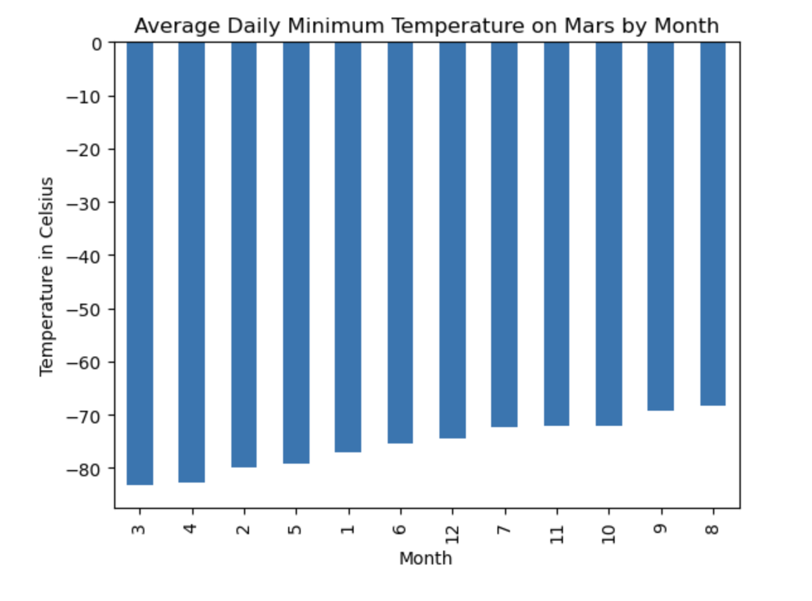
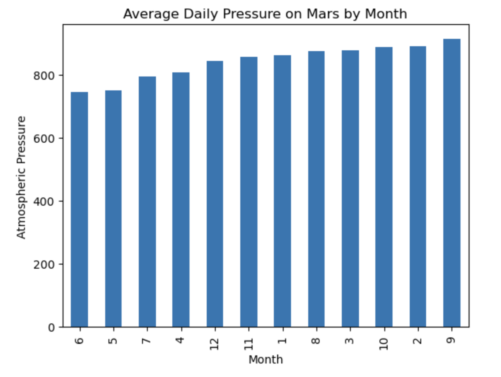
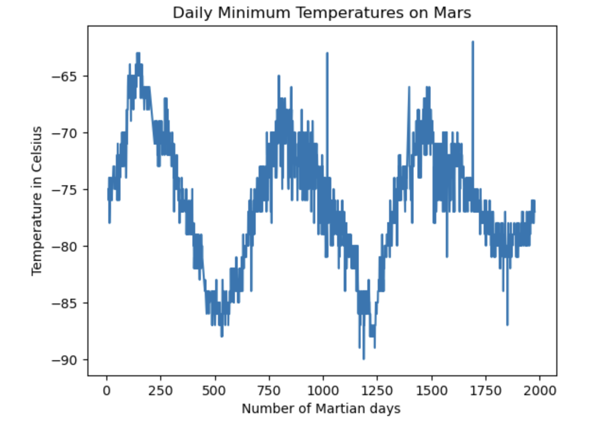

# mars

## Background
The aim of this project was to extract and analyze information about Mars from NASA's website.

## Methods
There were two parts to this project--two Jupyter Notebooks were written, respectively. First, titles sand preview text from news articles about Mars were scraped via Python's Beautiful Soup library. The other half of the assignment focused on analyzing the planet's weather. The data were originally presented as a table on NASA's website, which was scraped using Beautiful Soup. Alternatively, scraping could be achieved using Pandas library's read_html function. The scraped data were organized and stored as a list before being assembled into a DataFrame for analysis. The number of months, minimum temperatures (daily and monthly), and atmospheric pressure on Mars were computed and plotted on graphs. Lastly, the scraped weather data in a DataFrame were exported as a CSV file.

## Results
We were able to answer the following questions from this analysis:

    1. How many months exist on Mars?
        12

    2. How many Martian (and not Earth) days worth of data exist in the scraped dataset?
        1867

    3. What are the coldest and the warmest months on Mars (at the location of Curiosity)?
        On average, the third month is the coldest (down the -83 degrees Celsius) while the eighth month is the warmest (up to -68 degrees Celsius) on Mars.

 

    4. Which months have the lowest and the highest atmospheric pressure on Mars?
        On average, the sixth month has the lowest daily pressure (745 atm) while the ninth month has the highest daily pressure (913 atm) on Mars.

    5. About how many terrestrial (Earth) days exist in a Martian year?
        The graph below shows the waves of daily minimum temperatures taken from Curiosity. A year on Mars could be measured from taking the distance from peak to peak, which appears to be about 675 days. 

